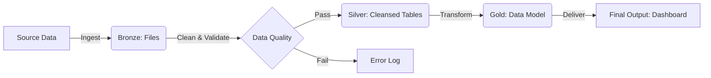
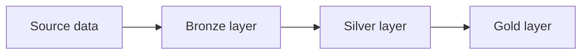

# Pipeline Architecture Diagram

## Diagram

## Questions to answer:

### One design decision
- We decided to decouple data validation from ingestion by storing raw data in its orignal form in the Bronze layer. All data cleansing was done in the silver layer.

### One question or risk
- We are unsure about the volume of data we need to process for this pipeline.
